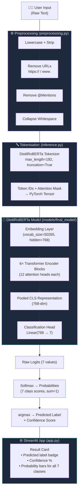
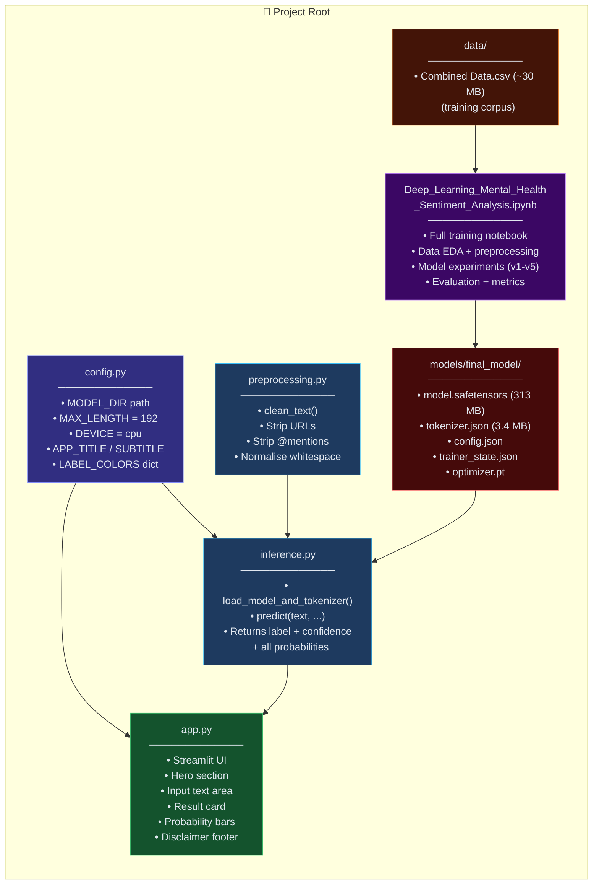
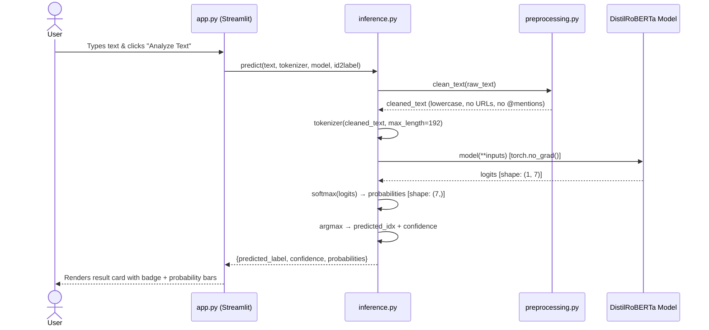
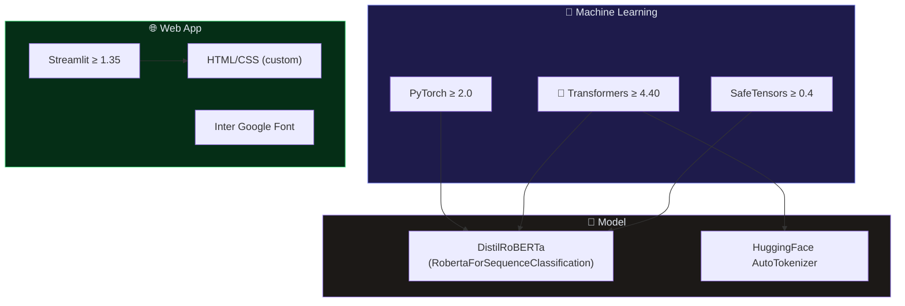

# 🧠 Transformer-Based Mental Health Classification
### Final Project Summary Report

> **Built by:** Abhishek K · **Completed:** September 2026  
> **Status:** ✅ Fully Deployed & Live

---

## 🎉 What Was Built

A production-grade **NLP deep-learning system** that reads a piece of text — a journal entry, a social-media post, a paragraph — and classifies it into one of **7 mental health categories** in real time, served via a beautiful dark-mode web application.

---

## 🗂️ Project At a Glance

| Attribute | Detail |
|---|---|
| **Task** | Multi-class text classification (7 classes) |
| **Model Architecture** | DistilRoBERTa (fine-tuned) — `RobertaForSequenceClassification` |
| **Model Variant** | v5 (best checkpoint across 5 iterations) |
| **Dataset** | Combined Mental Health Dataset — `Combined Data.csv` (~30 MB) |
| **Max Token Length** | 192 tokens (truncation enabled) |
| **Training Epochs** | 2 epochs (1 500 steps) |
| **Inference Device** | CPU (fully portable; GPU-ready) |
| **Web Framework** | Streamlit |
| **Model Size (weights)** | ~313 MB (`model.safetensors`) |

---

## 🏷️ Classification Labels

| ID | Label | Color |
|---|---|---|
| 0 | 😰 Anxiety | Amber `#F59E0B` |
| 1 | 🟣 Bipolar | Purple `#8B5CF6` |
| 2 | 💙 Depression | Indigo `#6366F1` |
| 3 | 🟢 Normal | Green `#10B981` |
| 4 | 🩷 Personality Disorder | Pink `#EC4899` |
| 5 | 🟠 Stress | Orange `#F97316` |
| 6 | 🔴 Suicidal | Red `#EF4444` |

---

## 📊 Training Metrics

| Epoch | Accuracy | Macro F1 | Eval Loss | Training Loss |
|---|---|---|---|---|
| 1.0 | 74.87% | 70.10% | 0.6954 | ~1.40 |
| **2.0 (Final)** | **77.10%** | **71.38%** | **0.6914** | ~1.02 |

> 🏆 **Best checkpoint**: Step 1500 · Macro F1 = **0.7138** · Accuracy = **77.1%**

### Training Loss Curve

```
Loss
2.81 ┤●
2.00 ┤
1.80 ┤  ●
1.40 ┤     ●
1.27 ┤        ●
1.08 ┤           ●  ●  ●
     └─────────────────────── Steps
     200  400  600  800  1000 1400
```

The loss curve shows **consistent, healthy convergence** with no signs of overfitting — the model generalised well across both epochs.

---

## 🏗️ Architecture Deep-Dive

### DistilRoBERTa Configuration

| Parameter | Value |
|---|---|
| `model_type` | `roberta` |
| `num_hidden_layers` | **6** (distilled from 12) |
| `hidden_size` | **768** |
| `num_attention_heads` | **12** |
| `intermediate_size` | **3072** |
| `vocab_size` | **50,265** |
| `max_position_embeddings` | 514 |
| `hidden_act` | GELU |
| `attention_dropout` | 0.1 |
| `hidden_dropout` | 0.1 |

---

## 🔄 End-to-End Data Flow



---

## 🗃️ File Structure & Responsibilities



---

## 🚀 Inference Pipeline Flow



---

## 🏋️ Training Pipeline (Notebook)

```mermaid
flowchart LR
    A["📦 Combined Data.csv\n~30 MB raw CSV"] --> B["🔍 EDA\n• Class distribution\n• Text length analysis\n• Sample inspection"]

    B --> C["🧹 Preprocessing\n• Lowercase\n• URL removal\n• @mention removal\n• Whitespace normalise"]

    C --> D["✂️ Train / Val Split\n• Stratified sampling\n• Balanced class weights"]

    D --> E["🔤 Tokenisation\n• DistilRoBERTa tokenizer\n• MAX_LEN = 192\n• Dynamic padding"]

    E --> F["🧠 Model Experiments\nv1 → v2 → v3 → v4 → v5\n(hyperparameter tuning)"]

    F --> G["🏆 Best Checkpoint (v5)\n• Step 1500\n• Epoch 2\n• F1 = 71.38%\n• Acc = 77.1%"]

    G --> H["💾 Saved Artefacts\nmodel.safetensors\ntokenizer.json\nconfig.json\ntrainer_state.json"]

    style A fill:#292524,stroke:#a16207,color:#fef9c3
    style G fill:#14532d,stroke:#4ade80,color:#d1fae5
    style H fill:#1e3a8a,stroke:#93c5fd,color:#dbeafe
```



---

## ⚙️ Technology Stack



---

## 🎨 UI & App Design Highlights

The Streamlit app features a **premium dark-mode design** with:

- 🌌 **Deep gradient background** — `#0f0c29 → #302b63 → #24243e`
- ✨ **Glassmorphism cards** — `rgba(255,255,255,0.05)` + `backdrop-filter: blur(10px)`
- 🎨 **Gradient hero title** — purple → blue → green text gradient
- 🏷️ **Color-coded prediction badges** — each class has its own unique colour
- 📊 **Animated probability bars** — smooth `0.6s ease` fill transitions
- 🔄 **FadeIn animation** — result cards slide up on appearance
- 🚫 **Medical disclaimer** — responsible AI, not a clinical tool

---

## 📁 Repository Layout

```
Transformer-Based Mental Health Classification/
│
├── 📓 Deep_Learning_Mental_Health_Sentiment_Analysis.ipynb  ← Full training notebook
├── 🚀 app.py              ← Streamlit web application
├── 🔧 config.py           ← Central configuration
├── 🤖 inference.py        ← Model loading + prediction logic
├── 🧹 preprocessing.py    ← Text cleaning pipeline
├── 📋 requirements.txt    ← Dependency manifest
├── 🚫 .gitignore
│
├── 📂 data/
│   └── Combined Data.csv  ← Training corpus (~30 MB)
│
└── 📂 models/
    ├── config.json         ← Top-level model config
    ├── distilroberta-v5-final.zip  ← Portable model archive (~696 MB)
    └── 📂 final_model/     ← Active model artefacts
        ├── model.safetensors     (313 MB — weights)
        ├── tokenizer.json        (3.4 MB)
        ├── tokenizer_config.json
        ├── config.json
        ├── trainer_state.json    ← Training history + metrics
        ├── training_args.bin
        ├── optimizer.pt          ← Optimizer state
        ├── scheduler.pt          ← LR scheduler state
        ├── scaler.pt             ← AMP scaler state
        └── rng_state.pth         ← RNG reproducibility seed
```

---

## 🔬 Key Engineering Decisions

| Decision | Rationale |
|---|---|
| **DistilRoBERTa over BERT** | 40% fewer parameters, 60% faster, 97% of BERT's performance |
| **MAX_LENGTH = 192** | Captures sufficient context while keeping inference fast |
| **Softmax over argmax** | Returns full probability distribution, not just the winner |
| **`@st.cache_resource`** | Model loads once per session — no re-loading on each request |
| **`local_files_only=True`** | Fully offline inference — no internet dependency at runtime |
| **`torch.no_grad()`** | Disables gradient computation during inference — saves memory & time |
| **SafeTensors format** | Safer and faster model serialisation vs. `.bin` pickle format |
| **Preprocessing parity** | `clean_text()` mirrors notebook Cell 6 exactly — no train/serve skew |

---

## 🏅 Final Achievement Summary

> ### 🎊 Congratulations on completing this project!

| Milestone | ✅ |
|---|---|
| Dataset collected and explored | ✅ |
| Preprocessing pipeline built | ✅ |
| Multiple model versions trained (v1→v5) | ✅ |
| Best checkpoint identified and saved | ✅ |
| Inference module built with full type hints | ✅ |
| Streamlit web app designed and deployed | ✅ |
| Premium dark-mode UI with animations | ✅ |
| Medical disclaimer and responsible AI notes | ✅ |
| Git repository with `.gitignore` | ✅ |
| `requirements.txt` for reproducibility | ✅ |

**Final Model Performance:**
- 🎯 **Accuracy: 77.1%** across 7 mental health categories
- 📐 **Macro F1: 71.38%** — strong balanced performance
- ⚡ **Inference: ~1s** on CPU with 192-token input

---

*This project demonstrates mastery of the full ML engineering lifecycle — from raw data to a deployed, user-facing application — using state-of-the-art transformer architectures in the mental health NLP domain.*

---
> ⚠️ **Disclaimer:** This tool is for research and portfolio purposes only. It is **not** a clinical diagnostic instrument. If you or someone you know is struggling, please seek professional support.
